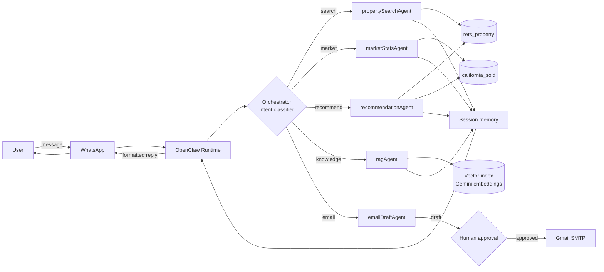

# Architecture (Week 1 draft)

## Request flow

## Components

| Component | Role |
|---|---|
| **Channels** | WhatsApp (primary), email (outbound, gated) |
| **Sessions** | Per-user state: current filters, last results, conversation step |
| **Orchestrator** | Classifies intent and routes to one or more agents; runs agents in parallel for mixed queries |
| **Skills / agents** | Property search, market stats, recommendations, RAG, email drafting |
| **Tools** | Typed async functions: parameterized SQL queries, embedding lookups, email send |
| **Memory** | Short-term session state plus a long-term vector index |
| **LLM** | Gemini 2.5 Flash (reasoning and generation), gemini-embedding-001 (vectors) |

## Data sources

- **`rets_property`**: active listings. Used for search, semantic matching (`L_Remarks`), and recommendations.
- **`california_sold`**: closed transactions, 2021–2025. Used for market stats and comp validation.
- **Join:** `CAST(rets_property.L_ListingID AS UNSIGNED) = california_sold.ListingKey`, or city + ZIP for market-level analysis.

## Safety rules

- Emails are drafted only and sent after explicit user approval.
- All SQL is parameterized, with at most 50 rows per query.
- Secrets live in `.env` only and are never logged.
